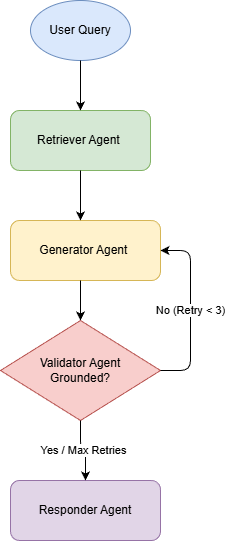

# Agentic RAG System

A Retrieval-Augmented Generation (RAG) system that ingests documents, extracts text using OCR, and enables users to chat with document content. The system is orchestrated using an agentic workflow built with LangGraph.

## System Architecture

The system follows a modular architecture with the following components:

```
agentic-rag/
├── app/
│   ├── agents/          # LangGraph agents (Retriever, Generator, Validator, Responder)
│   ├── embeddings/      # Vector store management (ChromaDB)
│   ├── graph/           # LangGraph workflow orchestration
│   ├── ingestion/       # Document loading, OCR, and text processing
│   ├── llm/             # LLM initialization and configuration
│   ├── state.py         # Shared state management (TypedDict)
│   └── main.py          # Main application entry point
├── data/                # Sample documents
└── vector_db/           # Persistent vector store (created at runtime)

```



### Workflow

The system uses LangGraph to orchestrate an agentic workflow:

1. **Retriever Agent**: Fetches relevant document chunks from the vector store based on user query.
2. **Generator Agent**: Uses an LLM to generate answers based on retrieved context.
3. **Validator Agent**: Evaluates the generated answer for relevance and hallucinations.
4. **Response Agent**: Returns the validated answer to the user.

The workflow includes shared state management (AgentState), conditional transitions based on validation, and a retry loop that allows up to 3 attempts for failed validation.

## Technologies and Libraries

### Core Dependencies

* **LangGraph**: Agentic workflow orchestration.
* **LangChain**: LLM framework and abstractions.
* **ChromaDB**: Vector database for embeddings storage.
* **Sentence Transformers**: Embedding models (`all-MiniLM-L6-V2`).

### Document Processing

* **pdf2image**: PDF to image conversion for OCR.
* **DeepSeek OCR**: High-performance OCR model used via the Simplismart API.

## Setup and Installation

### 1. Installation Steps

```bash
# Clone the repository
git clone https://github.com/NiteeshPutla/agentic-rag.git
cd agentic-rag

# Install dependencies using uv 
uv sync

# Or using pip
pip install -e .

```

### 3. Install Poppler (Required for PDF Processing)

The system requires Poppler for PDF-to-image conversion during OCR processing.

#### Windows:
1. Download Poppler for Windows from: http://blog.alivate.com.au/poppler-windows/
2. Extract the files to a folder (e.g., `C:\Program Files\poppler-25.12.0\`)
3. **Add to PATH**: Add the `Library\bin` folder to your system PATH:
   - Right-click "This PC" → Properties → Advanced system settings
   - Click "Environment Variables" → Select "Path" → Edit
   - Add: `C:\Program Files\poppler-25.12.0\Library\bin`

#### macOS:
```bash
brew install poppler
```

#### Linux (Ubuntu/Debian):
```bash
sudo apt-get update
sudo apt-get install poppler-utils
```


### 4. Set Up Environment Variables

#### Obtaining API Keys

**Google Gemini API Key:**
- Visit [Google AI Studio](https://aistudio.google.com/)
- Sign in with your Google account
- Create a new API key or use an existing one
- Copy the API key for use in your `.env` file

**DeepSeek OCR API Key (Simplismart):**
- Visit [Simplismart Playground](https://app.simplismart.ai/playground?model_id=81095ce8-515a-442a-8514-d4424ec84ce2)
- Sign up for an account if you don't have one
- Navigate to API settings or account section
- Generate your API key and header ID
- Use these credentials in your `.env` file

Create a `.env` file in the root directory and add your credentials:

```env
# LLM Provider Configuration
LLM_PROVIDER=gemini
GOOGLE_API_KEY="your-api-key"
GEMINI_MODEL=gemini-2.0-flash

# DeepSeek OCR Configuration (Simplismart API)
DEEPSEEK_API_KEY="simplismart-deepseek_api_key"
DEEPSEEK_OCR_ENDPOINT=https://api.simplismart.live
DEFAULT_HEADERS_ID={"id": "simplismart header"}

```

## Execution Instructions

### Running the System

You can run the core system through the main entry point:

```bash
python main.py

```

This script handles document ingestion (both standard and scanned) and launches an interactive chat loop.

### Web Interface (Streamlit)

For a user-friendly experience, launch the Streamlit app:

```bash
streamlit run gui.py

```

This interface allows for easy document uploads and real-time chat with the agentic assistant.


## Design Rationale

- **Self-Correction Loop**: The system uses a Validator Agent to check for hallucinations. If a response isn't grounded in the context, the system retries (up to 3 times) while passing the previous error back to the LLM for self-correction.
- **Dual Ingestion Pathway**: To handle both digital and scanned PDFs, the system uses a heuristic check; standard extraction is tried first, with a fallback to DeepSeek OCR via Simplismart for image-based documents.
- **Stateful Orchestration**: LangGraph manages the `AgentState`, ensuring that conversation history and retrieved documents are consistently available across all agent nodes.

**Author:** Niteesh Putla